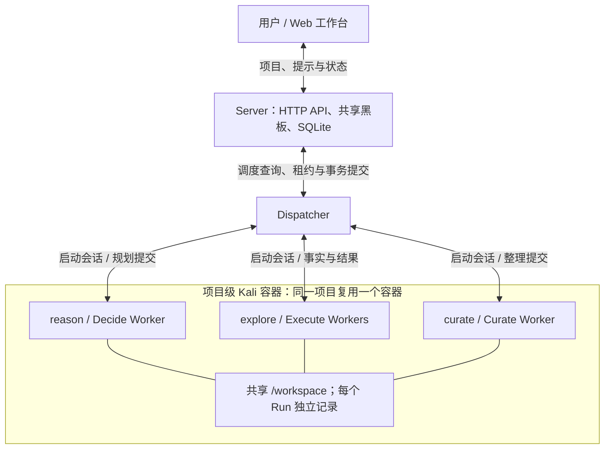
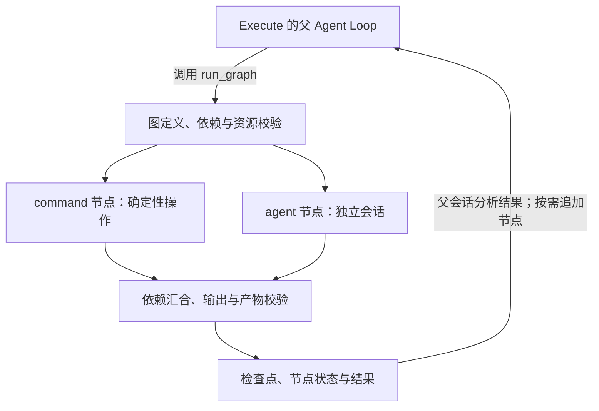

<div align="center">

# PwnMesh

**面向 CTF、授权渗透测试与代码审计的多 Worker AI 协作探索系统**

*Plan centrally. Explore in parallel. Keep the evidence.*

[](https://go.dev/)
[](https://www.docker.com/)
[](#环境要求)
[](./LICENSE)

[项目简介](#项目简介) · [核心能力](#核心能力) · [快速开始](#快速开始) · [使用限制](#使用限制与安全提示) · [授权说明](#授权说明)

</div>

---

## 项目简介

**PwnMesh** 是一个以 Go 构建的多 Worker AI 协作探索系统，面向 **CTF 题目研究、明确授权的渗透测试和代码安全审计**，将目标拆解、并行执行、证据记录与结果复核组织为持续推进的研究过程。

系统由 **Server、Dispatcher、Worker 和 Web 工作台**构成。Server 提供 HTTP API，维护共享黑板和执行记录，并通过 SQLite 持久化状态；Dispatcher 根据状态变化、Step 依赖、优先级与容量限制调度任务，管理租约、执行恢复及项目容器；Worker 使用项目内实现的 Go Agent Loop 调用模型和工具。

Refactor 分支将 Worker 的职责划分为 **`reason`（Decide）、`explore`（Execute）和 `curate`（Curate）**：Decide 规划下一批任务，Execute 执行具体检查并提交证据，Curate 在需要时整理重复或冲突的判断。Worker 内部还提供 Go 实现的图执行引擎，可按任务需要组合命令节点与独立 Agent 会话。

Docker 运行环境按项目复用：**同一项目使用一个 Kali 容器，多个 Worker 以独立进程和会话并发执行，共享 `/workspace`，各自保存 Run 记录。** Worker 数量表示执行任务的并发容量，不等于容器数量。

PwnMesh 用于辅助研究。模型判断、工具输出及项目完成状态仍需结合任务范围和原始证据复核。

> 本文对应 `Refactor` 分支的实现。项目品牌为 PwnMesh，仓库地址仍为 `do-whilefor/X-Loom`。

## 核心能力

- **决策、执行与整理分工：** `reason` 管理 Goal、Step 与项目完成决策；`explore` 执行指定 Step、发布增量 Fact 和 Candidate；`curate` 整理共享 Finding、事实关系与 Dispute。
- **按依赖与容量调度：** 支持 Step 前置依赖、优先级、全局并发、运行项目数、单项目并发及 Worker 配置的并发限制；为控制任务保留执行容量。
- **项目级容器与会话隔离：** Dispatcher 通过 Docker Engine API 创建或复用项目容器，通过 `docker exec` 启动 Worker；每个 Run 独立保存任务、会话、日志与证据。
- **Worker 内部图编排：** `run_graph` 支持命令与 Agent 混合的有向无环图、依赖传递、并行执行、条件分支、可选节点及按结果追加节点；保存检查点并核对输出与产物的 SHA-256。
- **结构化证据与冲突复核：** 区分原始观察、候选解释与共享结论；证据关联执行、文件及行范围，支持回读原始内容。冲突通过独立复核 Step 获取新证据后再处理。
- **共享状态与可靠提交：** 使用 SQLite 事务、WAL、租约与心跳、状态版本校验、幂等操作和决策批量提交，约束重复提交、过期结果及并发状态变更。
- **长任务上下文与恢复：** 提供有界上下文视图、分页读取、输入快照、会话检查点和上下文压缩；区分基础设施中断恢复、执行失败与用户取消。
- **Web 工作台：** 创建项目、补充提示，查看任务图、节点详情、执行活动和结论；支持暂停、继续、终止、重启归档及项目和时间线导出。
- **可配置模型接入：** 当前通过 Anthropic-compatible Messages API 调用模型，可配置服务地址、凭证、模型、推理强度、输出与上下文预算。

### 运行结构



图中的三个角色使用同一套 Worker 程序与 Agent Loop，分别受角色工具权限和任务协议约束。Server 是共享状态的提交入口，Worker 通过 Dispatcher 的 graph RPC 桥读取或提交状态。

| 组件 / 角色 | 主要职责 | 实现位置 |
| --- | --- | --- |
| Server / 共享黑板 | HTTP API、项目与执行状态、Goal / Step / Fact / Candidate / Finding / Dispute、事务与提交校验 | [`internal/server`](./internal/server)、[`internal/board`](./internal/board) |
| Dispatcher | 选择可执行任务与 Worker 配置、容量控制、租约续约、恢复和结果交付、项目容器管理 | [`internal/dispatcher`](./internal/dispatcher)、[`internal/docker`](./internal/docker) |
| `reason` / Decide | 根据有效事实和用户约束规划 Goal、Step、依赖及优先级；批量提交决策，核对项目完成条件 | [`reason.md`](./internal/worker/prompts/reason.md) |
| `explore` / Execute | 执行当前 Step，调用环境工具或内部图，提交证据支持的 Fact、候选判断及 Step 结果 | [`explore.md`](./internal/worker/prompts/explore.md) |
| `curate` / Curate | 基于固定输入快照整理相关判断，记录共享结论、关系和争议；按独立复核证据处理冲突 | [`curate.md`](./internal/worker/prompts/curate.md) |
| Agent Loop / Worker 图引擎 | 模型与工具循环、会话和上下文管理、图依赖执行及检查点 | [`internal/agent`](./internal/agent)、[`internal/worker`](./internal/worker)、[`internal/workergraph`](./internal/workergraph) |
| Web 工作台 | 项目操作、任务图、执行活动、结果与导出入口 | [`web`](./web) |

**任务如何推进：**

1. 用户提交项目类型、原始输入和目标。Server 保存项目输入及共享状态；新项目使用 `orchestration_version=1`。
2. Dispatcher 启动 `reason`，由 Decide 从当前事实出发规划有限数量的 Step。规划动作先进入私有草稿，再由 Server 校验并在事务中批量提交。
3. Dispatcher 按前置依赖、有效来源、优先级和容量启动 `explore`。同一项目的多个 Execute 会话共享项目环境，各自拥有独立 Run 目录。
4. Execute 发布重要的增量事实，并在当前检查及要求的产物核验后完成 Step。证据可以支持正向发现，也可以支持明确范围内的负向结果。
5. 普通事实和已完成 Step 可直接支撑后续执行或规划。出现相关判断重叠、冲突、失效的结论支持，或明确整理请求时，才调度 `curate`；尚无法确认的冲突保留为争议，再由 Decide 规划独立复核 Step。
6. 新事实、用户提示、执行结果及前提变化推动后续决策。Dispatcher 合并短时间内的普通状态变化，并优先推进已授权且依赖就绪的任务，减少重复规划。Decide 对照原始要求与证据提交完成决策后，工作台展示结果。

**Worker 内部如何执行：**

`explore` 的外层执行图为 `prepare → agent → accept`，负责执行身份检查、运行 Agent 会话和持久化结果验收。Agent 会话内部可直接调用工具，也可使用 `run_graph` 创建或扩展一个命令 / Agent 混合 DAG：



- 单个内部图最多 **64 个累计节点**，并行度为 **1–16**；默认取节点数与 16 的较小值。命令节点超时上限为 **120 秒**，Agent 节点为 **600 秒**，同时受父任务剩余期限约束。
- 使用同一个 graph key 追加节点时，需保留此前完整节点定义。已完成节点经输出与产物校验后复用；共享可变资源需通过 `resources` 声明，并用依赖关系确定写入顺序。
- 子 Agent 在同一容器内运行，拥有独立会话和节点目录，只处理父 Step 指定的子任务；不能再次委派、发布黑板记录或完成父 Step。父会话负责综合结果并提交证据。
- 图引擎由 Go 实现，模型调用仍由 Agent Loop 负责。部署无需安装 LangGraph、Claude Code CLI 或额外的 Python Agent 编排服务。

## 适用场景

| 场景 | 典型用途 |
| --- | --- |
| CTF / 靶场 | 题目理解、线索拆解、并行探索、结果核验与解题过程整理 |
| 授权渗透测试 | 在明确范围内拆分验证任务，记录技术命中、影响条件、负向结果与原始证据 |
| 代码审计 | 分析项目结构、追踪危险调用与数据流、组织候选问题及验证任务 |
| 安全研究 | 持续推进多步骤任务，复用已确认事实，处理相互冲突的解释和证据 |

工作台提供 `ctf`、`pentest`、`audit` 三种项目类型。当前 `ctf` 和 `pentest` 有专用场景提示词，`audit` 使用通用任务流程；项目类型本身不代表已经完成验证或取得测试授权。

## 快速开始

### 环境要求

- **Docker Engine 与 Docker Compose 插件**，使用 Linux 容器；Dispatcher 通过 Unix Socket 访问 Docker Engine。
- 能访问所配置的模型 API，并具备有效凭证。接口需兼容当前使用的 Anthropic Messages、流式响应、工具调用及推理参数。
- 能拉取基础镜像及安装 Kali、Python、Node.js 和浏览器依赖。首次构建 headless 工具镜像需要较多时间、磁盘与网络资源。
- Worker 镜像显式使用 **`linux/amd64`**。其他架构可能需要模拟运行，兼容性与性能需自行验证。
- 按下述 Docker 方式部署，无需在宿主机安装 Go、Python 或 Node.js；源码的 `go.mod` 声明 **Go 1.23.0**，主 Dockerfile 使用 **Go 1.26** 构建。
- 仅在可信主机上部署：Dispatcher 需要挂载宿主机 Docker Socket；保持默认回环访问地址，按需要配置访问控制。

### 1. 获取代码

```bash
git clone --branch Refactor --single-branch https://github.com/do-whilefor/X-Loom.git
cd X-Loom
```

已有仓库可在保留本地修改后切换分支：

```bash
git fetch origin Refactor
git switch Refactor
git pull --ff-only origin Refactor
```

项目品牌为 PwnMesh；仓库地址和默认克隆目录仍为 `X-Loom`。

### 2. 准备配置

```bash
cp .env.example .env
cp dispatch.example.yaml dispatch.yaml
```

编辑 `.env`，填写模型服务信息：

```dotenv
ANTHROPIC_AUTH_TOKEN=your_token
ANTHROPIC_BASE_URL=your_anthropic_compatible_base_url
ANTHROPIC_DEFAULT_FABLE_MODEL=your_model_name
PWNMESH_PORT=8000
```

当前 Provider 使用 Anthropic-compatible **Messages API**：基础地址以 `/messages` 结尾时直接使用，以 `/v1` 结尾时追加 `/messages`，其余情况追加 `/v1/messages`。请填写实际支持该协议的服务地址，并确认模型支持所配置的推理强度及预算。

按主机资源和模型限制调整 `dispatch.yaml`。默认 Worker 使用：

```yaml
container:
  image: pwnmesh-worker:dev
  network_mode: bridge
  completed_action: stop
  namespace: pwnmesh
workers:
  - name: general
    type: go
    task_types: [reason, curate, explore]
    max_running: 16
    priority: 0
```

上述内容是现有配置中对应字段的示意；完整配置以 [`dispatch.example.yaml`](./dispatch.example.yaml) 为起点。

| 配置项 | 示例默认值 | 含义 |
| --- | --- | --- |
| `runtime.max_workers` | `16` | 所有项目正在运行的 `reason`、`curate`、`explore` 任务总上限 |
| `runtime.max_running_projects` | `4` | 同时纳入调度的项目上限 |
| `runtime.max_project_workers` | `4` | 单项目运行任务总上限 |
| `workers[].max_running` | `16` | 该 Worker 配置在所有项目中的任务并发上限 |
| `tasks.reason.max_intents` | `3` | 一次 Decide 最多新增的探索方向数 |
| `tasks.reason.timeout` / `tasks.curate.timeout` | `300` / `300` | 决策与整理任务期限，单位秒 |
| `tasks.explore.timeout` | `0` | 关闭 Execute 总执行期限；可设置为正数限制运行时间 |
| `tasks.explore.conclude_timeout` | `60` | Execute 进入收尾阶段后的时间预算，单位秒 |
| `container.completed_action` | `stop` | 项目完成时停止并保留容器；`remove` 会移除容器 |

并发上限统计顶层 Worker 任务；`run_graph` 的节点并发在任务内部单独设置。Dispatcher 会为 Decide / Curate 保留容量，因此总上限并不等于可同时启动的 Execute 数。

`common_env` 中还可配置 `PWNMESH_REASONING_EFFORT`、`PWNMESH_MAX_OUTPUT_TOKENS`、`PWNMESH_CONTEXT_TOKENS`、`PWNMESH_CONTEXT_TARGET_TOKENS` 和 `PWNMESH_CONTEXT_BYTES`。示例中的大上下文与输出预算需按实际模型能力调整；各角色可通过 `tasks.<role>.reasoning_effort` 覆盖推理强度，支持 `low`、`high`、`max`。

### 3. 构建镜像

在**仓库根目录**执行。先构建主镜像，再构建 Worker 镜像；后者从本地 `pwnmesh:dev` 复制程序和 CA 证书：

```bash
docker build -t pwnmesh:dev .
docker build -f container/Dockerfile -t pwnmesh-worker:dev .
```

主 Dockerfile 在构建阶段执行 Go race 测试和 `go vet`；Worker Dockerfile 在构建阶段运行离线环境自检。

Worker 基于 Kali rolling，安装 `kali-linux-headless` 与补充工具，包含 Python 3.13 环境、pwntools、MongoDB 客户端、云 CLI 和 Playwright / Chromium。镜像不附带额外的漏洞知识库、PoC、`AGENTS.md`、`CLAUDE.md` 或技能目录。工具与版本以 [`container/Dockerfile`](./container/Dockerfile) 和 [`container/README.md`](./container/README.md) 为准。

构建后可再次运行镜像内置自检：

```bash
docker run --rm --pull never --network none --init \
  --entrypoint /usr/local/share/pwnmesh/check-worker.sh pwnmesh-worker:dev
```

如需切换 Kali APT 镜像源，使用 `--build-arg KALI_MIRROR=https://kali.download/kali`；其他构建参数与环境约定见 [`container/README.md`](./container/README.md) 和 [`container/environment.md`](./container/environment.md)。

### 4. 启动服务

```bash
docker compose up -d --no-build
docker compose ps
```

默认访问地址：**[http://127.0.0.1:8000](http://127.0.0.1:8000)**。需要调整宿主机端口时，在 `.env` 中设置 `PWNMESH_PORT`，例如 `PWNMESH_PORT=8080`。

Compose 常规启动的是 **Server 和 Dispatcher**。`worker-image` 属于镜像构建 profile；实际项目容器由 Dispatcher 按需创建或复用，默认名称为 `pwnmesh-dispatch-<project-id>`，同一项目的 Worker 在该容器内运行。

打开工作台后创建项目，选择 CTF、渗透测试或代码审计，并填写原始输入和明确目标。原始输入中应提供授权范围、已知条件、所需文件位置与操作限制；运行期间可补充提示并查看任务图、执行活动和结果。

需要读取本地源码或附件时，须先使其实际存在于对应项目容器的 `/workspace`。仅在输入中写出宿主机文件路径，不会自动上传或挂载该文件。

### 5. 查看日志与停止

```bash
# 查看控制服务日志
docker compose logs -f server dispatcher

# 查看动态项目容器
docker ps -a --filter label=pwnmesh.namespace=pwnmesh

# 停止并移除 Compose 服务容器
docker compose down
```

项目的模型与工具活动可在工作台查看。原始 Run 数据位于对应项目容器的 **`/workspace/.pwnmesh/runs/<run-id>`**；项目共享文件位于 `/workspace`。

Server 默认通过名为 `<Compose项目名>_pwnmesh-data` 的命名卷保存 SQLite 数据，数据库路径为 `/data/pwnmesh.db`。`docker compose down` 通常保留该卷，使用 `-v` 前需确认是否仍需要其中的数据。

**Server 数据卷与项目工作区分开保存。** 项目容器的 `/workspace` 当前没有独立的持久化卷；默认 `completed_action: stop` 保留容器文件，设置为 `remove` 或在工作台删除项目会移除对应容器。备份完整任务时，应同时保存 Server 数据和需要的项目工作区。`docker compose down` 不会自动删除这些动态项目容器。

### 从旧版本升级

先等待正在执行的任务结束，并备份 Server 数据及需要保留的项目工作区，再停止旧服务、切换 `Refactor` 分支，同步重建 Server / Dispatcher 主镜像与 Worker 镜像。避免让新旧版本处理同一批运行中的任务。

已有 `.env`、`dispatch.yaml` 不会自动改写，应对照新的示例文件更新配置：

- 镜像和命名空间使用 `pwnmesh` / `pwnmesh-worker`；程序配置暂时兼容旧 `XLOOM_*` 环境变量，显式设置的 `PWNMESH_*` 优先，Compose 使用新名称。
- 当前 Worker 后端仅支持 `type: go`，任务类型为 `reason`、`curate`、`explore`；移除旧的 `bootstrap` 任务配置，补齐 `curate` 配置。
- 新项目使用 `orchestration_version=1`，Worker 使用结果协议 2。**旧协议项目保留读取和导出能力，但不能在 Refactor 中继续执行、重启或写入。** 需要继续研究时，应创建新项目，并重新提供已复核的输入、约束及证据。

历史数据不会自动移动。复用旧数据卷时，先通过 `docker volume ls` 确认实际名称，再在 `.env` 中设置：

```dotenv
PWNMESH_DATA_VOLUME=your_existing_data_volume
PWNMESH_DB_PATH=/data/xloom.db
```

数据库路径须与原部署一致；上述 `xloom.db` 仅是旧路径示例。直接运行命令行时，可使用 `pwnmesh serve --db-path /原路径/xloom.db`。内部 `xloom_*` 表名保留兼容，复用数据库不会自动迁移容器内的证据文件或工作区。

旧项目所需的 `.xloom` 证据和其他文件应另行保留；新 Run 使用 `.pwnmesh`。对于仍需运行的当前协议项目，如果既有项目容器的镜像 ID、网络或 capabilities 与新配置不一致，Dispatcher 会拒绝复用；应先保留并迁移工作区，再按新配置重建项目环境。

## 使用限制与安全提示

- **仅限合法授权：** 只针对自己拥有、明确获得授权的系统，以及赛事明确允许的 CTF / 靶场环境使用；遵守资产、账号、接口、时间窗口与测试方式限制。
- **禁止滥用：** 不得用于未经授权的入侵、凭证攻击、数据窃取、破坏、持久化、横向移动、拒绝服务，或其他违法和侵害第三方权益的行为。
- **结论需人工复核：** 模型判断、扫描命中、Agent 的一致意见与协议校验通过，均不能单独证明漏洞成立或业务目标已满足。应检查原始证据、实际影响、覆盖范围和反例。
- **容器与目录隔离范围：** Dispatcher 挂载 Docker Socket，Worker 默认以 root 运行；同一项目的多个 Worker 与子 Agent 共享容器和项目文件，独立 Run / 节点目录只用于组织会话与产物。应在可信、独立的研究环境部署。
- **共享文件写入：** 将同一交付物交给明确的写入任务；内部图中操作同一可变资源的节点需声明资源并按依赖排序。黑板事务并不替代项目文件的写入协调。
- **信息保护：** 输入模型的目标资料、源码、日志、Cookie、凭证及其他数据，应符合授权、保密要求和模型服务的数据处理约定。镜像不预置云凭据。
- **恢复与重试边界：** 可恢复的基础设施中断和用户取消、执行失败分别处理；检查点和产物校验用于约束重复执行，不能保证任意外部操作可安全重放。内部图出现结果不确定的中断时，需先核对实际影响。
- **资源与模型预算：** 多 Worker 及内部 Agent 图共同消耗模型额度、CPU、内存、磁盘和网络。并发、任务期限、上下文及输出预算应与主机和模型能力匹配；示例的 Execute 总期限为 `0`，需要时应设置正数上限。

项目作者不对使用者是否取得测试授权作出保证；使用者须自行对具体目标、操作和产生的后果负责。

## 授权说明

PwnMesh 采用 **[PolyForm Noncommercial License 1.0.0](./LICENSE)**，是一份带有非商业用途限制的源码可用许可证。

在完整许可证允许的范围内，可进行非商业学习、研究、实验、修改和分发；分发时应遵守许可证及通知保留要求。商业产品、商业服务、SaaS、收费安全服务或其他超出许可范围的用途，需要另行取得权利人的授权。具体使用是否属于许可范围，应以许可证全文及实际使用情形为准。

商业使用、其他特别授权或许可问题，请通过仓库 Issues 与项目维护者联系；Issues 沟通本身不构成授权。完整法律条款以仓库 [`LICENSE`](./LICENSE) 为准。

---

<div align="center">

**PwnMesh · For authorized security research only.**

</div>
