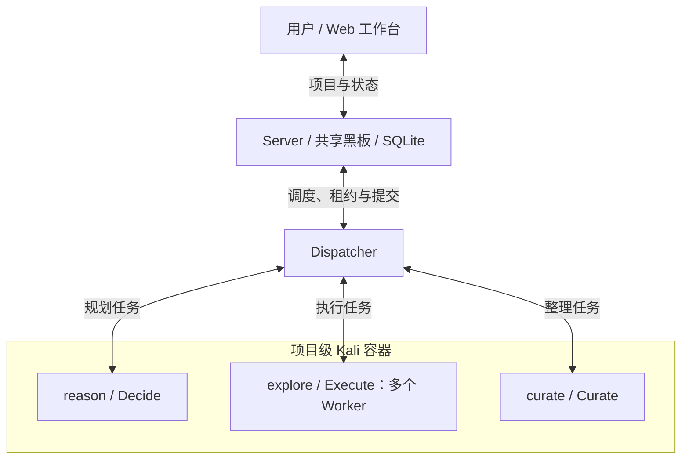

<div align="center">

# PwnMesh

**面向 CTF、授权渗透测试与代码审计的多 Worker AI 协作探索系统**

*Plan centrally. Explore in parallel. Keep the evidence.*

[](https://go.dev/)
[](https://www.docker.com/)
[](#环境要求)
[](./LICENSE)

[项目简介](#项目简介) · [核心能力](#核心能力) · [快速开始](#快速开始) · [使用限制](#使用限制与安全提示) · [授权说明](#授权说明)

</div>

---

## 项目简介

**PwnMesh** 是基于 Go 的多 Worker AI 协作探索系统，面向 CTF、授权渗透测试与代码审计，支持任务规划、并行执行、证据记录和结果复核。

系统由 **Server、Dispatcher、Worker 和 Web 工作台**构成：Server 维护共享黑板与持久化状态，Dispatcher 管理任务调度、租约和项目容器，Worker 通过 Go Agent Loop 调用模型与工具，工作台提供项目管理和过程展示。

## 核心能力

- **协作探索：** 决策、执行与结论整理分工，支持多方向并行验证和基于事实的持续规划。
- **图式执行：** Worker 内部支持命令与 Agent 混合 DAG、依赖传递、条件分支、并行执行及检查点。
- **证据管理：** 分别记录事实、候选判断、共享结论和争议，关联原始证据并支持独立复核。
- **可靠调度：** 支持并发控制、任务依赖、优先级、租约心跳、执行恢复和幂等提交。
- **上下文管理：** 提供输入快照、按需读取、会话持久化和上下文压缩，支撑长任务执行。
- **Web 工作台：** 查看任务图与执行活动，补充提示，暂停、继续、终止或重启项目，并导出项目和时间线。

### 运行结构



| Worker 角色 | 职责 |
| --- | --- |
| `reason` / Decide | 根据有效事实和用户约束规划 Goal、Step、依赖与优先级，核对项目完成条件 |
| `explore` / Execute | 执行指定 Step，调用工具或内部图，提交证据支持的事实与候选判断 |
| `curate` / Curate | 按需整理重叠或冲突的判断，维护共享结论和争议，依据独立复核证据处理冲突 |

**每个项目复用一个 Kali 容器。** 多个 Worker 以独立进程和会话并发运行，共享 `/workspace`，各自保存 Run 记录。状态通过 Dispatcher 提交至 Server，由 SQLite 事务、租约和版本校验保障写入一致性。

Execute 可通过 `run_graph` 组合命令节点与独立 Agent 会话；子 Agent 处理局部任务，父会话综合结果并提交证据。普通事实可直接支撑后续任务，结论整理按需触发。

## 适用场景

| 场景 | 典型用途 |
| --- | --- |
| CTF / 靶场 | 线索拆解、并行探索、结果核验与解题过程整理 |
| 授权渗透测试 | 验证任务拆分、工具辅助执行、影响分析与证据整理 |
| 代码审计 | 代码结构分析、危险调用与数据流追踪、候选问题验证 |
| 安全研究 | 多步骤探索、假设交叉验证、冲突复核与过程追踪 |

## 快速开始

### 环境要求

- Docker Engine 与 Docker Compose 插件，使用 Linux 容器；Worker 镜像采用 `linux/amd64`。
- 可访问所配置的模型 API，接口兼容 Anthropic Messages 的流式响应、工具调用与推理参数。
- 可拉取镜像和构建依赖，并预留 Kali 工具镜像所需的磁盘与网络资源。

### 1. 获取代码

```bash
git clone --branch Refactor --single-branch https://github.com/do-whilefor/X-Loom.git
cd X-Loom
```

### 2. 准备配置

```bash
cp .env.example .env
cp dispatch.example.yaml dispatch.yaml
```

在 `.env` 中填写模型服务信息：

```dotenv
ANTHROPIC_AUTH_TOKEN=your_token
ANTHROPIC_BASE_URL=your_anthropic_compatible_base_url
ANTHROPIC_DEFAULT_FABLE_MODEL=your_model_name
PWNMESH_PORT=8000
```

在 `dispatch.yaml` 中调整并发、任务期限与模型预算，完整示例见 [`dispatch.example.yaml`](./dispatch.example.yaml)。默认 Worker 镜像为 `pwnmesh-worker:dev`，后端为 `go`，任务类型为 `reason`、`curate`、`explore`。输出和上下文预算应与实际模型能力匹配。

### 3. 构建镜像

在仓库根目录依次构建主镜像与 Worker 镜像：

```bash
docker build -t pwnmesh:dev .
docker build -f container/Dockerfile -t pwnmesh-worker:dev .
```

Worker 基于 Kali headless，集成安全工具、Python 环境和 Playwright / Chromium。工具与构建参数见 [`container/README.md`](./container/README.md)。

### 4. 启动服务

```bash
docker compose up -d --no-build
docker compose ps
```

访问 **[http://127.0.0.1:8000](http://127.0.0.1:8000)**，创建项目并填写原始输入、目标和操作限制。运行期间可补充提示，查看任务图、执行记录和结果。修改 `.env` 中的 `PWNMESH_PORT` 可调整访问端口。

Compose 启动 Server 和 Dispatcher，项目容器由 Dispatcher 按需创建。代码与附件需放入对应项目容器的 `/workspace`，供 Worker 读取。

### 5. 查看日志与停止

```bash
# 查看服务日志
docker compose logs -f server dispatcher

# 查看项目容器
docker ps -a --filter label=pwnmesh.namespace=pwnmesh

# 停止控制服务
docker compose down
```

Server 数据保存在 Docker 命名卷，Run 记录位于项目容器的 `/workspace/.pwnmesh/runs/<run-id>`。默认 `completed_action: stop` 保留项目容器；备份时需同时保存 Server 数据和项目工作区。删除项目容器或使用 `docker compose down -v` 前，应确认相关数据已保存。

## 使用限制与安全提示

- **合法授权：** 仅用于自有系统、明确授权的目标和允许测试的 CTF / 靶场，遵守资产、时间和操作范围；禁止用于未经授权的入侵、数据窃取或破坏。
- **人工复核：** 模型判断、工具命中与项目完成状态需结合原始证据、实际影响和覆盖范围核验。
- **可信部署：** Dispatcher 挂载 Docker Socket，Worker 默认以 root 运行；项目内共享容器与文件，需协调共享文件的写入。
- **信息保护：** 源码、日志、凭证及其他输入应符合保密要求和模型服务的数据处理约定。
- **资源控制：** 根据主机和目标环境设置并发、执行期限及模型预算，保留必要的任务数据与证据。

使用者须对测试授权、具体操作及产生的后果负责。

## 授权说明

PwnMesh 采用 **[PolyForm Noncommercial License 1.0.0](./LICENSE)**，允许在许可证规定的范围内进行非商业学习、研究、修改和分发。超出许可范围的商业用途需另行取得权利人授权，完整条款以 [`LICENSE`](./LICENSE) 为准。

商业授权或其他许可问题，请通过仓库 Issues 联系维护者；沟通本身不构成授权。

---

<div align="center">

**PwnMesh · For authorized security research only.**
> 重构前版本SHA：a6fde4dd2c4061f997966c1e08436d2cc583f9b0
</div>
