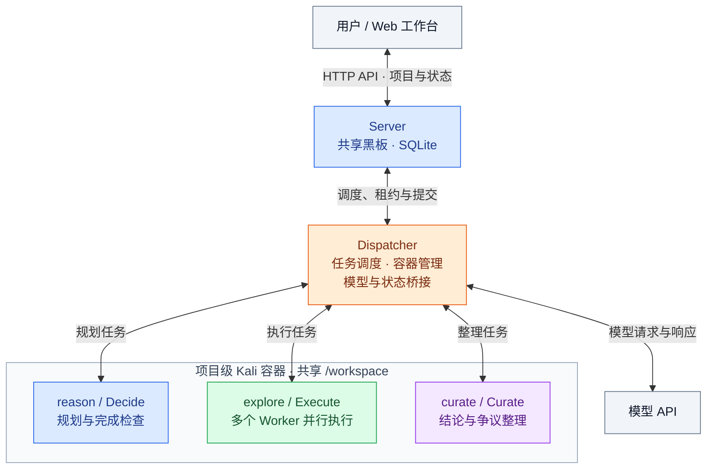

<div align="center">


# PwnMesh

**面向 CTF、授权渗透测试与代码审计的多 Worker AI 协作探索系统**

*Plan centrally. Explore in parallel. Keep the evidence.*

[](https://go.dev/)
[](https://www.docker.com/)
[](#环境要求)
[](./LICENSE)

[项目简介](#项目简介) · [核心能力](#核心能力) · [快速开始](#快速开始) · [使用限制](#使用限制与安全提示) · [授权说明](#授权说明)

</div>

## 项目简介

PwnMesh 是基于 Go 的多 Agent 任务执行系统，面向 CTF、授权渗透测试、代码审计与技术研究。系统根据用户目标规划任务，在项目容器中并行调用工具，记录执行证据，并据此调整计划、整理结果。

## 核心能力

- **任务协作**：规划、执行与结论整理分工，支持任务依赖、优先级和多方向并行探索。
- **Web 与客户端分析**：支持浏览器操作、HTTP 请求重放、代码审计，以及 APK/JAR 静态分析。
- **图式执行**：组合命令节点与子 Agent，按依赖和条件执行，汇总各分支结果。
- **证据与恢复**：保留事实、候选结论、争议和原始证据，支持输入快照、会话持久化与执行恢复。
- **Web 工作台**：创建项目、上传材料、补充信息，查看任务图与执行记录，暂停、继续、终止、重启或导出项目。

## 运行结构


```mermaid
flowchart TB
    U["用户 / Web 工作台"] <-->|"HTTP API · 项目与状态"| S["Server<br/>共享黑板 · SQLite"]
    S <-->|"调度、租约与提交"| D["Dispatcher<br/>任务调度 · 容器管理<br/>模型与状态桥接"]
    D <-->|"模型请求与响应"| M["模型 API"]
    subgraph P["项目级 Kali 容器 · 共享 /workspace"]
        R["reason / Decide<br/>规划与完成检查"]
        E["explore / Execute<br/>多个 Worker 并行执行"]
        C["curate / Curate<br/>结论与争议整理"]
    end
    D <-->|"规划任务"| R
    D <-->|"执行任务"| E
    D <-->|"整理任务"| C

    classDef entry fill:#f1f5f9,stroke:#64748b,color:#0f172a
    classDef service fill:#dbeafe,stroke:#2563eb,color:#1e3a8a
    classDef dispatcher fill:#ffedd5,stroke:#ea580c,color:#7c2d12
    classDef execute fill:#dcfce7,stroke:#16a34a,color:#14532d
    classDef curate fill:#f3e8ff,stroke:#9333ea,color:#581c87
    class U,M entry
    class S,R service
    class D dispatcher
    class E execute
    class C curate
    style P fill:#f8fafc,stroke:#94a3b8,color:#334155
```

| 角色 | 职责 |
| --- | --- |
| `reason` | 根据用户目标与有效事实制定计划，检查完成条件 |
| `explore` | 执行具体任务，调用工具并提交事实与证据 |
| `curate` | 按需整理候选结论、重复信息与争议 |

Compose 启动 Server 和 Dispatcher；Dispatcher 在同一调度命名空间内按项目创建并复用容器。多个 Worker 以独立进程运行，共享 `/workspace`，模型调用和共享状态读写经 Dispatcher 桥接。Server 数据存入 Docker 命名卷，执行记录保存在项目容器的 `/workspace/.pwnmesh/runs/`。

<a id="快速开始"></a>
<a id="环境要求"></a>

## 安装教程

需要 Linux x86_64、Docker Engine、Docker Compose 插件，以及兼容 Anthropic Messages 流式响应和工具调用的模型服务。完整 Worker 使用 Kali 环境，首次构建需下载工具及浏览器依赖。

```bash
git clone --branch main https://github.com/do-whilefor/PwnMesh.git
cd PwnMesh
cp .env.example .env
cp dispatch.example.yaml dispatch.yaml
```

编辑 `.env`，填写 `ANTHROPIC_AUTH_TOKEN`、`ANTHROPIC_BASE_URL` 和 `ANTHROPIC_DEFAULT_FABLE_MODEL`。按实际模型能力调整 `dispatch.yaml` 中的输出、上下文预算及并发设置，再依次执行：

```bash
docker build -t pwnmesh:dev .
docker build -f container/Dockerfile -t pwnmesh-worker:dev .
docker compose up -d --no-build
```

打开 [http://127.0.0.1:8000](http://127.0.0.1:8000)，创建项目、填写目标和操作范围，并上传所需材料。模型设置也可在工作台中管理。配置示例见 [dispatch.example.yaml](./dispatch.example.yaml)，工具环境见 [container/environment.md](./container/environment.md)。

## 使用限制与安全提示

使用前请阅读 [免责声明与使用合规须知](./SECURITY.md)。

- **合法授权：** 仅用于自有系统、明确授权的目标和允许测试的 CTF / 靶场，遵守资产、时间和操作范围；禁止用于未经授权的入侵、数据窃取或破坏。
- **人工复核：** 模型判断、工具命中与项目完成状态需结合原始证据、实际影响和覆盖范围核验。
- **可信部署：** Dispatcher 挂载 Docker Socket，Worker 默认以 root 运行；项目内共享容器与文件，需协调共享文件的写入。
- **信息保护：** 源码、日志、凭证及其他输入应符合保密要求和模型服务的数据处理约定。
- **资源控制：** 根据主机和目标环境设置并发、执行期限及模型预算，保留必要的任务数据与证据。

使用者须对测试授权、具体操作及产生的后果负责。

## 授权说明

PwnMesh 采用 [PolyForm Noncommercial License 1.0.0](./LICENSE)。可在许可证规定的范围内进行非商业使用、研究、修改和分发；超出许可范围的商业用途需另行取得权利人授权。完整条款以许可证为准。

<div align="center">

**PwnMesh · For authorized security research only.**

> 重构前版本SHA：a6fde4dd2c4061f997966c1e08436d2cc583f9b0

</div>
